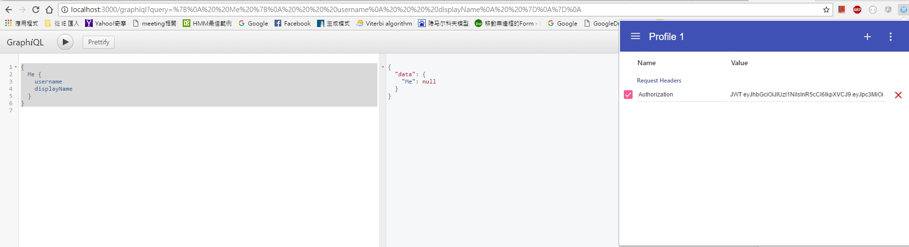

Backend API with user authentication
---

## Quick Start
- `npm install`
- build /dist with `npm run build` or `yarn run build`
- development with `npm run dev` or `yarn run dev`
- production with `npm start` or `yarn start`

## Graphql tool
Tool for test your queries: `localhost:3000/graphiql`

## Documentation

### Step
Use rest api to create account and get json web token by login.
>1. post `api/users` - create new account
>2. post `api/users/login` - login and get jwt token then frontend can store this token to use other api

### Set header with chrome extenston
1. browser url input: `chrome://extensions/`
> 

2. Select with `Get more extensions`
> 

3. Search `Modheader`
4. click `ADD TO CHROME`
5. refresh your page
6. open `Modheader`
7. set jwt token in your request headers.
> 


### Query user by id
```graphql
{
    User(id: "your user id") {
        username
        displayName
    }
}
```

### Query current user
```graphql
{
    Me {
        username
        displayName
    }
}
```

### Logout
```graphql
mutation Mutation {
 Logout{
  token
 }
}
```